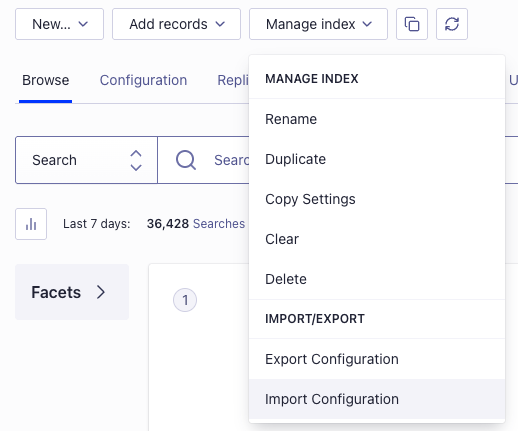

<div align="center">
  <h1> B2C Storefront
    <br> 
for <a href="https://github.com/mercurjs/mercur">Mercur</a> - Open Source Marketplace Platform  </h1>
  <!-- Shields.io Badges -->
  <a href="https://github.com/mercurjs/mercur/tree/main?tab=MIT-1-ov-file">
    
  </a>
  <a href="#">
    
  </a>
  <a href="https://mercurjs.com/contact">
    
  </a>
  <!-- Website Links -->
  <p>
  <a href="https://b2c.mercurjs.com/">🛍️ B2C Marketplace Storefront Demo </a> · <a href="https://mercurjs.com/">Mercur Website</a> · <a href="https://docs.mercurjs.com/">📃 Explore the docs</a> 
  </p> 
</div>

## B2C Storefront for Marketplace

Customizable storefront designed for B2C with all elements including browsing and buying products across multiple vendors at once.

Ready to go:

- Home Page - <a href="https://b2c.mercurjs.com/">🛍️ Check demo </a>
- Listing
- Product Page
- Shopping Cart
- Seller Page
- Selling Hub - Moved to external <a href="https://github.com/mercurjs/vendor-panel">VendorPanel</a>
- Wishlist

# Part of Mercur

<a href="https://github.com/mercurjs/mercur">Mercur</a> is an open source marketplace platform that allows you to create high-quality experiences for shoppers and vendors while having the most popular Open Source commerce platform MedusaJS as a foundation.

Mercur is a platform to start, customize, manage, and scale your marketplace for every business model with a modern technology stack.


## Quickstart

### Installation

Clone the repository

```js
git clone https://github.com/mercurjs/b2c-marketplace-storefront.git
```

&nbsp;

Go to directory

```js
cd b2c-marketplace-storefront
```

&nbsp;

Install dependencies

```js
npm install
```

&nbsp;

Make a .env.local file and copy the code below

```js
# API URL
MEDUSA_BACKEND_URL=http://localhost:9000
# Your publishable key generated in mercur admin panel
NEXT_PUBLIC_MEDUSA_PUBLISHABLE_KEY=
# Your public url
NEXT_PUBLIC_BASE_URL=http://localhost:3000
# Default region
NEXT_PUBLIC_DEFAULT_REGION=pl
# Stripe payment key. It can be random string, don't leave it empty.
NEXT_PUBLIC_STRIPE_KEY=supersecret
# Backend cookie secret
REVALIDATE_SECRET=supersecret
# Your site name in metadata
NEXT_PUBLIC_SITE_NAME="Clickfynd Marketplace"
# Your site description in metadata
NEXT_PUBLIC_SITE_DESCRIPTION="Clickfynd Marketplace"
# Algolia Application ID
NEXT_PUBLIC_ALGOLIA_ID=supersecret
# Algolia Search API Key
NEXT_PUBLIC_ALGOLIA_SEARCH_KEY=supersecret
#TalkJS APP ID
NEXT_PUBLIC_TALKJS_APP_ID=<your talkjs app id>
```

&nbsp;

Start storefront

```js
npm run dev
```

&nbsp;

### Guides

#### <a href="https://www.algolia.com/doc/guides/security/api-keys/" target="_blank">How to get Aloglia Keys</a>

#### <a href="https://talkjs.com/docs/Reference/Concepts/Sessions/" target="_blank">How to get TalkJs App ID</a>

### Configure Algolia index

To work Algolia correctly you need to configure facets and searchable attributes. You can use import function to upload <a href="./algolia-config.json">algolia-config.json</a> file
&nbsp;

In Algolia dashboard chose your index and select Import configuration from Manage index dropdown menu
&nbsp;



&nbsp;

<a href="./algolia-config.json">algolia-config.json</a>

```js
{
  "settings": {
    "minWordSizefor1Typo": 4,
    "minWordSizefor2Typos": 8,
    "hitsPerPage": 20,
    "maxValuesPerFacet": 100,
    "searchableAttributes": [
      "title",
      "subtitle",
      "brand.name",
      "tags.value",
      "type.value",
      "categories.name",
      "collection.title",
      "variants.title"
    ],
    "numericAttributesToIndex": null,
    "attributesToRetrieve": null,
    "unretrievableAttributes": null,
    "optionalWords": null,
    "attributesForFaceting": [
      "average_rating",
      "filterOnly(categories.id)",
      "categories.name",
      "seller.handle",
      "seller.store_status",
      "filterOnly(supported_countries)",
      "searchable(title)",
      "variants.color",
      "variants.condition",
      "variants.prices.currency_code",
      "variants.size"
    ],
    "attributesToSnippet": null,
    "attributesToHighlight": null,
    "paginationLimitedTo": 1000,
    "attributeForDistinct": null,
    "exactOnSingleWordQuery": "attribute",
    "ranking": [
      "typo",
      "geo",
      "words",
      "filters",
      "proximity",
      "attribute",
      "exact",
      "custom"
    ],
    "customRanking": null,
    "separatorsToIndex": "",
    "removeWordsIfNoResults": "none",
    "queryType": "prefixLast",
    "highlightPreTag": "<em>",
    "highlightPostTag": "</em>",
    "alternativesAsExact": ["ignorePlurals", "singleWordSynonym"],
    "renderingContent": {
      "facetOrdering": {
        "facets": {
          "order": ["variants.color", "variants.size", "variants.condition"]
        },
        "values": {
          "variants.color": {
            "sortRemainingBy": "count"
          },
          "variants.condition": {
            "sortRemainingBy": "count"
          },
          "variants.size": {
            "sortRemainingBy": "count"
          }
        }
      }
    }
  },
  "rules": [],
  "synonyms": []
}
```

---

## Custom Features (ClickFynd)

This project includes several custom marketplace features built on top of Mercur.

### Republish Flow

Vendors can republish expired listings directly from the vendor panel.

- Available when a product is in `draft` state and marked as expired
- Vendor selects a new listing duration:
  - 10h (4% fee)
  - 24h (6% fee)
  - 48h (8% fee)
- Product is set back to `published`
- Previous listing metadata is overwritten
- A new listing lifecycle begins on republish

Updated metadata:
- `listing_duration_hours`
- `listing_fee_bps`
- `listing_published_at`
- `listing_expires_at`
- `listing_is_expired`

---

### Listing Expiration Logic

- Listings expire based on `listing_expires_at`
- A cron job runs every hour
- Expired products are:
  - set to `draft`
  - marked with `listing_is_expired = true`

---

### Listing Fee Rules

Listing fees are dynamically applied based on duration:

| Duration | Fee |
|----------|-----|
| 10h      | 4%  |
| 24h      | 6%  |
| 48h      | 8%  |

Rules are stored in the `listing_fee_rule` module.

---

### Product View Tracking

- Product views are tracked when visiting the product detail page
- Stored in `product_view`
- Deduplicated per:
  - visitor
  - product
  - 24h window
- Duplicate views are ignored within 24h per visitor
- Prevents artificial inflation of popularity

Used for **Popular** products.

---

### Active Listings Filtering

Only active listings are shown in storefront sections.

A listing is considered active if:
- `listing_is_expired = false`
- `listing_expires_at` is in the future

---

### Homepage Sections Logic

The homepage is powered by custom ranking logic:

- **Popular**
  - Based on product views from the last 7 days
  - Only active (non-expired) listings are included
  - Results use a rolling 7-day window

- **New Arrivals**
  - Based on `listing_published_at`

- **Best Sellers (Fler fynd)**
  - Based on product sales from the last 7 days
  - Based on completed purchases
  - Reflects real market demand

---

### Custom API Endpoints

#### Vendor API

- `POST /vendor/products/:id/republish`
- `GET /vendor/listing-fee-rules`

#### Store API

- `POST /store/products/:id/view`
- `GET /store/products/popular`
- `GET /store/products/new-arrivals`
- `GET /store/products/bestsellers`

---

### Custom Modules

- `listing_fee`
  - Handles duration → fee logic

- `product_view`
  - Tracks product views

- `product_sale`
  - Tracks product sales for bestseller ranking

---

### Background Jobs & Subscribers

- **Expire Listings Job**
  - Runs hourly
  - Marks expired listings as draft

- **Product Publish Subscriber**
  - Sets listing metadata on approval

- **Order Subscriber**
  - Applies dynamic listing fees on purchase

---

### Marketplace Logic Summary

- Listings are time-limited assets
- Visibility is driven by:
  - popularity (views)
  - recency (published date)
  - performance (sales)
- Expired listings must be republished to re-enter the marketplace